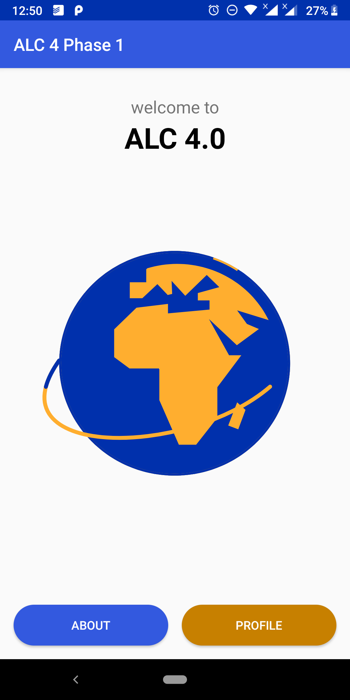

# Profile App
   

This is a simple application that displays my profile consisting of email, mobile, slack username and country.

This app has been achieved with the following components:
- WebView
- Activity Lifecycle
-	Intents and Android Permissions

###### For app demo [click here](https://appetize.io/app/yhacw7x461h4cek1qdmbmrybb0?device=nexus5&scale=75&orientation=portrait&osVersion=8.1)
###### For final app apk [click here](https://drive.google.com/open?id=1M1YDD6oI1S2abMjVBYqTbYEC7Acj1dy7) to download

## Prerequisites
You will need the following to run this project:
1. A machine with internet access (Laptop or desktop)
2. Android studio 3.4 or later

## Setting up
* Clone the repository from GitHub
* Open the project folder using Android Studio IDE
* Wait to for build to finish and you're good to go

## Features
#### Landing activity
The app opens the homepage of the app and user can choose either to view the ALC about page or my profile.

#### ALC about activity
On clicking the about button the user is taken to a WebView that loads the ALC about page.

#### Profile activity
On clicking the profile button the user is taken to an activity that displays my details.

## Contributions
Find any typos? Have another resource you think should be included? Contributions are welcome!
* First, fork this repository
* Next, clone this repository to your desktop/laptop to make changes

		` $ git clone {YOUR_REPOSITORY_CLONE_URL}`

		` $ cd alc-4.0-phase-1`

* Once you've pushed changes to your local repository, you can issue a pull request by clicking on the green pull request icon.
